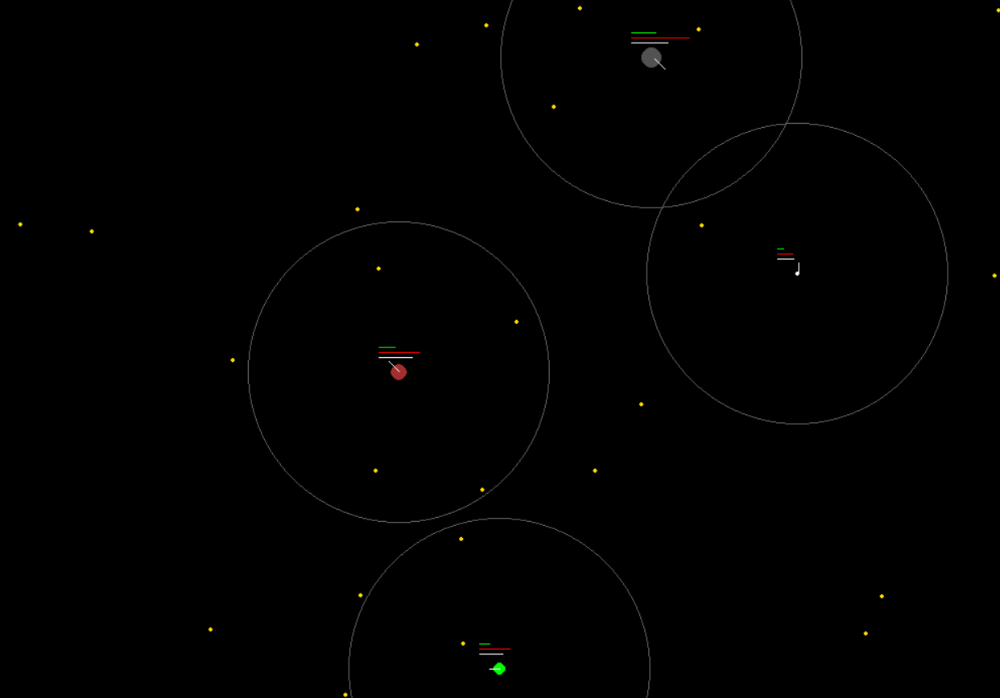

# Vivarium

## Code couleur

**Agents :**
- Vegetal : petit et jaune
- Decomposeur : petit et blanc
- Carnivore : moyen et rouge
- Herbivore : moyen et vert
- Superpredateur : gros et gris

**Jauges :**
- Reproduction : vert
- Faim : rouge
- Fatigue : blanc

**Rayon :**
- Il montre la zone de vision que possède chaque agent

## Fonctionnement

Manger :
Chaque agent va "chasser" en fonction de sa faim; par exemple, sachant que mon vivarium possède énormément de végétaux, les herbivores vont commencer à vouloir manger quand il leur reste seulement 30% de faim.

Dormir :
Lorsque la jauge de fatigue de l'agent arrive à sa fin, il s'arrête et dort.

Protéger :
Seul l'herbivore peut se protéger de l'espèce carnivore : pour se faire, il va chercher à se coller au prédateur.